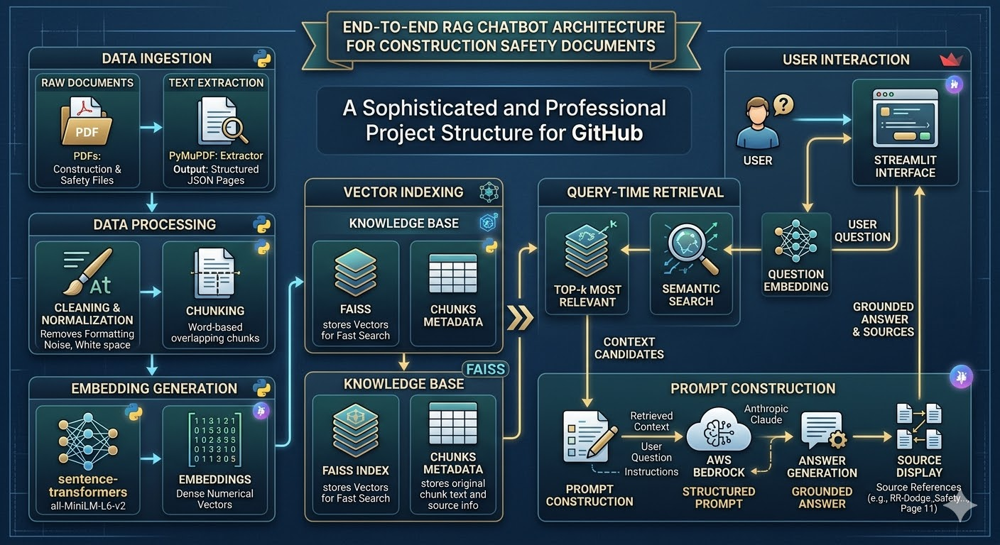
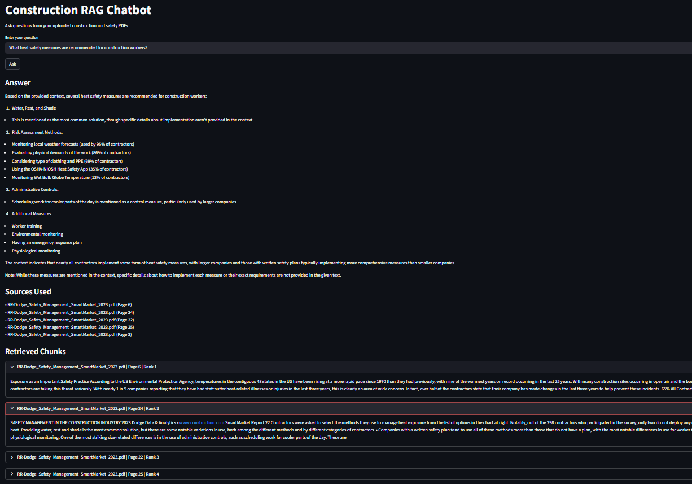
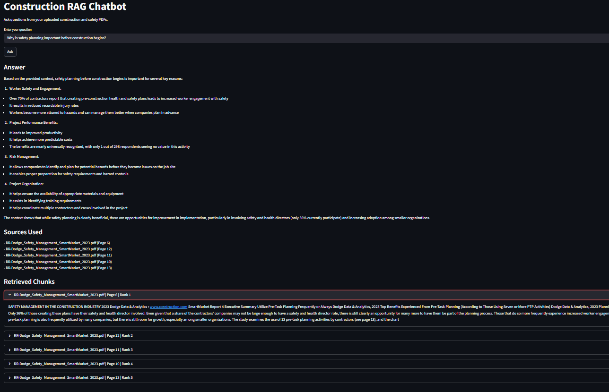
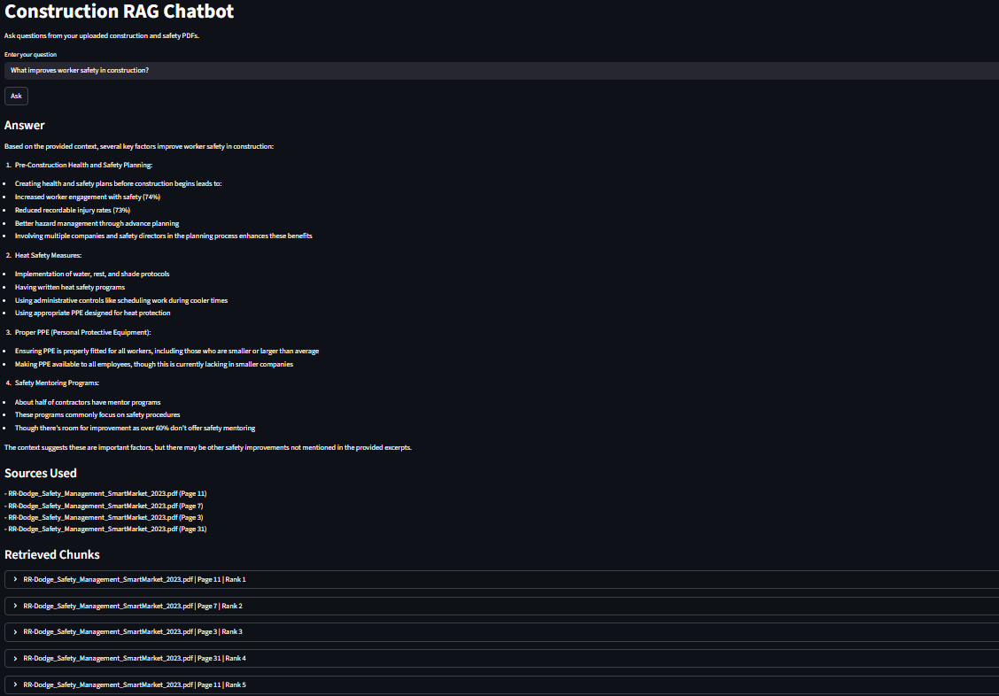
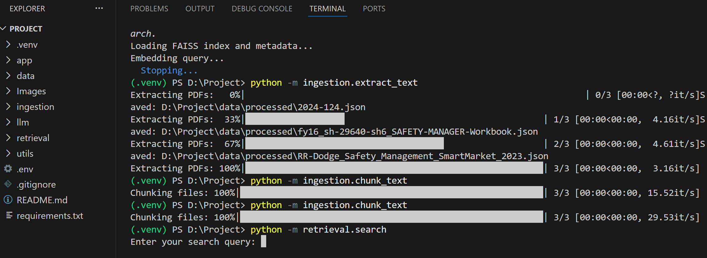

# Aws-Bedrock-Rag-Pdf-Chatbot

A Retrieval-Augmented Generation (RAG) system that processes PDFs into a searchable vector knowledge base and uses AWS Bedrock to generate grounded answers with source references.



## Overview

This project is an end-to-end PDF question-answering system designed around a modular RAG architecture. It transforms raw PDF documents into a searchable semantic knowledge base, retrieves the most relevant passages for a user query, and uses AWS Bedrock to generate answers that are grounded in retrieved context rather than relying on generic model memory.

The architecture image above summarizes the full workflow:

1. **Raw PDF ingestion**  
   Documents are placed in `data/raw/` and parsed page by page. Each page is converted into structured JSON containing the source filename, page number, and extracted text. This creates a machine-readable intermediate format from otherwise unstructured PDFs.

2. **Text cleaning and normalization**  
   Extracted PDF text often includes line breaks, spacing inconsistencies, and formatting artifacts. The cleaning stage standardizes the text so that semantically related content remains coherent before chunking and embedding.

3. **Chunk creation**  
   Cleaned text is split into overlapping chunks. This is a critical design choice in RAG systems: chunks need to be small enough for precise retrieval, but large enough to preserve context. Overlap helps prevent important meaning from being lost across chunk boundaries.

4. **Embedding generation**  
   Each chunk is embedded using `sentence-transformers/all-MiniLM-L6-v2`. These embeddings convert text into dense vectors so that similarity is based on semantic meaning rather than exact keyword overlap.

5. **Vector indexing with FAISS**  
   The embeddings are stored in a FAISS index, while the original chunk metadata is saved separately. This allows the system to perform efficient nearest-neighbor retrieval and still trace results back to the exact file and page.

6. **Query-time semantic retrieval**  
   When a user asks a question, the same embedding model converts the query into a vector. FAISS then retrieves the top-matching chunks from the indexed knowledge base.

7. **Prompt construction and grounded generation**  
   Retrieved chunks are assembled into a structured context prompt together with the question and instructions. That prompt is sent to AWS Bedrock, which generates a context-grounded response.

8. **Answer presentation with traceability**  
   The final output includes both the generated answer and the source references used to build it. This improves trust, transparency, and usability.

Together, these stages create a practical document intelligence workflow that is modular, inspectable, and suitable for extending into more advanced RAG features such as reranking, hybrid retrieval, or conversational memory.

## Key Features

- PDF text extraction using **PyMuPDF**
- Text cleaning and normalization for retrieval-ready content
- Overlapping chunk generation for better context preservation
- Semantic embeddings using **SentenceTransformers**
- Vector similarity search with **FAISS**
- Grounded answer generation using **AWS Bedrock**
- Source-aware responses with page-level references
- Interactive interface built with **Streamlit**
- Modular codebase designed for iteration and extension

## Project Structure

```text
Aws-Bedrock-Rag-Pdf-Chatbot/
├── app/
│   └── main.py                  # Streamlit application
├── data/
│   ├── raw/                     # Input PDF files
│   ├── processed/               # Extracted page-level JSON
│   ├── chunks/                  # Chunked JSON files
│   └── index/                   # FAISS index + metadata
├── Images/
│   ├── architecture.png
│   ├── 1.png
│   ├── 2.png
│   ├── 3.png
│   └── 4.png
├── ingestion/
│   ├── extract_text.py          # PDF extraction
│   ├── clean_text.py            # Text cleaning
│   └── chunk_text.py            # Chunk generation
├── llm/
│   ├── prompts.py               # Prompt templates
│   ├── qa.py                    # Retrieval + Bedrock answer generation
│   ├── summarise.py             # Reserved for summarization workflows
│   └── sentiment.py             # Reserved for sentiment workflows
├── retrieval/
│   ├── embed_store.py           # Embedding generation + FAISS indexing
│   └── search.py                # Query embedding + semantic search
├── utils/
│   ├── config.py                # Shared paths and config
│   └── file_io.py               # JSON/text load-save helpers
├── .env                         # Local environment variables (not committed)
├── .gitignore
├── LICENSE
├── README.md
└── requirements.txt
```

## Core Workflow

### 1. Ingestion

The ingestion pipeline reads PDFs from `data/raw/` and converts them into structured page-level JSON. Each record contains:

- `source_file`
- `page_number`
- `text`

This stage establishes the foundation for all downstream processing.

### 2. Cleaning

The extracted text is normalized to remove formatting noise such as broken line breaks and excessive whitespace. This improves both chunk quality and embedding consistency.

### 3. Chunking

The cleaned text is divided into overlapping chunks, each stored with its own metadata:

- `chunk_id`
- `source_file`
- `page_number`
- `text`

This is the retrieval unit used by the vector search layer.

### 4. Embedding and Indexing

All chunks are embedded using the SentenceTransformers model and then indexed using FAISS. The index enables fast semantic similarity search, while metadata preserves traceability.

Artifacts generated during this stage include:

- `faiss_index.bin`
- `chunks_metadata.json`

### 5. Retrieval

At query time, the user question is embedded and matched against the FAISS index. The system retrieves the top relevant chunks and prepares them as context.

### 6. Answer Generation

The retrieved context and user question are formatted into a structured prompt and sent to AWS Bedrock. The returned answer is displayed together with the sources used.

## Demo

The following images show the system in action.

### Query example 1

This example demonstrates a question submitted through the Streamlit interface, along with the generated answer, source references, and retrieved context.



### Query example 2

This image highlights another retrieval-and-generation flow, showing how the system handles a different prompt using the same indexed PDF knowledge base.



### Query example 3

This example further illustrates grounded answering behavior across a different query, reinforcing how the application surfaces both the response and its underlying evidence.



### Development workflow

This image captures part of the development environment and execution workflow used to process documents and run the project locally.



## Example Questions

These are useful prompts for testing the system:

- What improves worker safety in construction?
- Why is safety planning important before construction begins?
- What are the benefits of having a health and safety plan before construction starts?
- How does pre-construction planning reduce injury rates?
- What role does worker engagement play in safety outcomes?
- What heat safety measures are recommended for workers?
- Why is proper PPE important?
- How do mentoring programs improve safety culture?
- What factors increase the benefits of safety planning?

## Tech Stack

- **Python**
- **PyMuPDF** for PDF extraction
- **SentenceTransformers** for embedding generation
- **FAISS** for vector similarity search
- **AWS Bedrock** for grounded answer generation
- **Boto3 / Botocore** for Bedrock integration
- **Streamlit** for the user interface
- **python-dotenv** for environment variable loading
- **tqdm** for progress reporting

## Installation

### 1. Clone the repository

```bash
git clone https://github.com/<your-username>/Aws-Bedrock-Rag-Pdf-Chatbot.git
cd Aws-Bedrock-Rag-Pdf-Chatbot
```

### 2. Create and activate a virtual environment

On Windows PowerShell:

```powershell
python -m venv .venv
Set-ExecutionPolicy -Scope Process -ExecutionPolicy Bypass
.venv\Scripts\Activate.ps1
```

### 3. Install dependencies

```bash
pip install -r requirements.txt
```

### 4. Configure environment variables

Create a `.env` file with values similar to:

```env
AWS_REGION=ap-southeast-2
AWS_BEARER_TOKEN_BEDROCK=your_bedrock_api_key
BEDROCK_MODEL_ID=apac.anthropic.claude-3-5-sonnet-20241022-v2:0
```

## Usage

### Step 1: Place PDFs in the raw data folder

```text
data/raw/
```

### Step 2: Extract PDF text

```bash
python -m ingestion.extract_text
```

### Step 3: Clean the extracted text

```bash
python -m ingestion.clean_text
```

### Step 4: Chunk the cleaned text

```bash
python -m ingestion.chunk_text
```

### Step 5: Build embeddings and the FAISS index

```bash
python -m retrieval.embed_store
```

### Step 6: Test semantic search from the terminal

```bash
python -m retrieval.search
```

### Step 7: Run the full Streamlit app

```bash
streamlit run app/main.py
```

## Why This Project Matters

This project demonstrates the practical building blocks of a modern RAG system:

- document ingestion
- preprocessing and chunking strategy
- semantic embedding generation
- vector database indexing
- query-time retrieval
- prompt orchestration
- grounded LLM response generation
- source transparency in answers
- lightweight interactive deployment

It serves as a strong example of how LLMs can be combined with retrieval infrastructure to create useful assistants over private or domain-specific document collections.

## Current Strengths

- Modular pipeline with clear separation of concerns
- End-to-end working RAG flow
- Real LLM integration through AWS Bedrock
- Verifiable answers through source references
- GitHub-ready project structure and visuals

## Future Improvements

Potential enhancements include:

- reranking after FAISS retrieval
- hybrid keyword + vector search
- upload-based ingestion directly from the UI
- conversation memory for follow-up questions
- sentence-aware or semantic chunking
- caching for faster Streamlit performance
- inline citations inside generated answers
- OCR support for scan-heavy PDFs
- full UI integration for summarization and sentiment workflows

## License

This project is distributed under the terms of the license provided in the `LICENSE` file.
